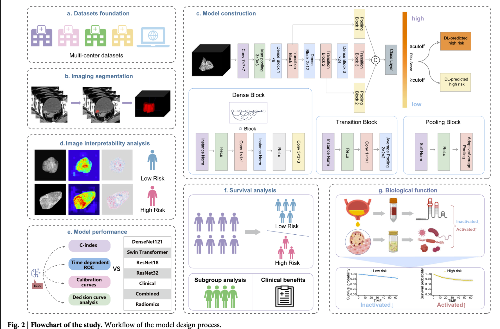

# MTC3D

## 0. 介绍

MTC3D 是一个基于3D图像的肿瘤检测模型，主要用于肿瘤的早期筛查。

文件介绍

data.py: 
- 读取原始数据
- 保存处理后的数据
- 保存预处理后的mask

clean_data.py: 
- 清理数据，删除无效数据
- 保存清理后的数据

dataset.py: 
- 定义数据集类

model.py 
- 定义模型类

train.py  
- 定义训练函数

infer.py 
- 定义推理函数

train_utils.py
- 定义训练过程中的辅助函数

## 1. 数据处理

### - 图片处理

原始图片：512x512xN 单通道

mask大小：512x512xN 0/1 mask=1对应的区域为tumor

N 为 序列长度，整体是3D的CT图像序列

处理脚本：data.py

风险项：不确定mask的质量，即mask部分是否真的是肿瘤

### - 标签处理

二分类的分类任务，标签为0/1

none = 1，则 level = 0，为低风险

none = 空，则 level = 1，为高风险

处理脚本：clean_data.py

## 2. 模型训练

模型输入：3D image + 3D mask

预测：label

## 3. 模型评估指标

### AUC

综合了 precision 和 recall，AUC 越大，模型的预测能力越好。

### Shap

见 shap_results，蓝色为低风险部分，红色为高风险部分

### CAM results

见 cam_results 
